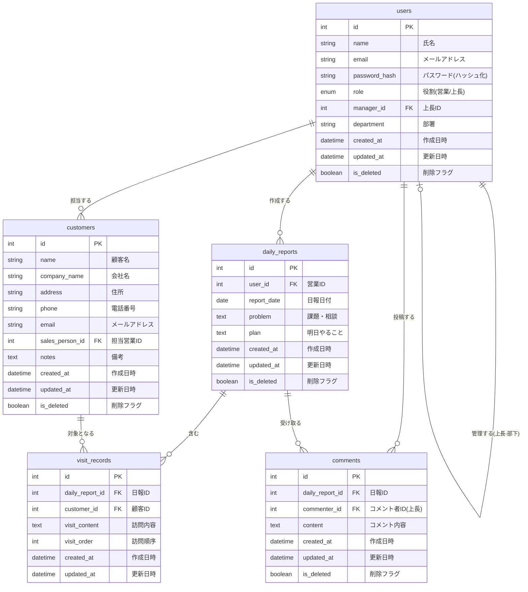

# 営業日報システム ER図

## 1. テーブル定義詳細

### 1.1 users（営業マスタ）

営業担当者と上長の情報を管理するテーブル

| カラム名      | 型                      | NULL | キー   | 説明                                |
| ------------- | ----------------------- | ---- | ------ | ----------------------------------- |
| id            | INT                     | NO   | PK     | ユーザーID（自動採番）              |
| name          | VARCHAR(100)            | NO   |        | 氏名                                |
| email         | VARCHAR(255)            | NO   | UNIQUE | メールアドレス（ログインID）        |
| password_hash | VARCHAR(255)            | NO   |        | パスワード（ハッシュ化）            |
| role          | ENUM('sales','manager') | NO   |        | 役割（営業/上長）                   |
| manager_id    | INT                     | YES  | FK     | 上長ID（usersテーブルへの外部キー） |
| department    | VARCHAR(100)            | YES  |        | 部署名                              |
| created_at    | DATETIME                | NO   |        | 作成日時                            |
| updated_at    | DATETIME                | NO   |        | 更新日時                            |
| is_deleted    | BOOLEAN                 | NO   |        | 削除フラグ（論理削除）              |

**制約**:

- email は UNIQUE 制約
- manager_id は users(id) への外部キー（自己参照）

### 1.2 customers（顧客マスタ）

訪問先の顧客情報を管理するテーブル

| カラム名        | 型           | NULL | キー | 説明                                    |
| --------------- | ------------ | ---- | ---- | --------------------------------------- |
| id              | INT          | NO   | PK   | 顧客ID（自動採番）                      |
| name            | VARCHAR(100) | NO   |      | 顧客名                                  |
| company_name    | VARCHAR(200) | NO   |      | 会社名                                  |
| address         | VARCHAR(500) | YES  |      | 住所                                    |
| phone           | VARCHAR(20)  | YES  |      | 電話番号                                |
| email           | VARCHAR(255) | YES  |      | メールアドレス                          |
| sales_person_id | INT          | NO   | FK   | 担当営業ID（usersテーブルへの外部キー） |
| notes           | TEXT         | YES  |      | 備考                                    |
| created_at      | DATETIME     | NO   |      | 作成日時                                |
| updated_at      | DATETIME     | NO   |      | 更新日時                                |
| is_deleted      | BOOLEAN      | NO   |      | 削除フラグ（論理削除）                  |

**制約**:

- sales_person_id は users(id) への外部キー

### 1.3 daily_reports（日報）

営業担当者が日々作成する日報の基本情報を管理するテーブル

| カラム名    | 型       | NULL | キー                         | 説明                                |
| ----------- | -------- | ---- | ---------------------------- | ----------------------------------- |
| id          | INT      | NO   | PK                           | 日報ID（自動採番）                  |
| user_id     | INT      | NO   | FK                           | 営業ID（usersテーブルへの外部キー） |
| report_date | DATE     | NO   | UNIQUE(user_id, report_date) | 日報日付                            |
| problem     | TEXT     | YES  |                              | 課題・相談                          |
| plan        | TEXT     | YES  |                              | 明日やること                        |
| created_at  | DATETIME | NO   |                              | 作成日時                            |
| updated_at  | DATETIME | NO   |                              | 更新日時                            |
| is_deleted  | BOOLEAN  | NO   |                              | 削除フラグ（論理削除）              |

**制約**:

- user_id は users(id) への外部キー
- (user_id, report_date) の組み合わせは UNIQUE（1人の営業が同じ日に複数の日報を作成できない）

### 1.4 visit_records（訪問記録）

日報に紐づく顧客訪問の記録を管理するテーブル

| カラム名        | 型       | NULL | キー | 説明                                        |
| --------------- | -------- | ---- | ---- | ------------------------------------------- |
| id              | INT      | NO   | PK   | 訪問記録ID（自動採番）                      |
| daily_report_id | INT      | NO   | FK   | 日報ID（daily_reportsテーブルへの外部キー） |
| customer_id     | INT      | NO   | FK   | 顧客ID（customersテーブルへの外部キー）     |
| visit_content   | TEXT     | NO   |      | 訪問内容                                    |
| visit_order     | INT      | NO   |      | 訪問順序（1から始まる連番）                 |
| created_at      | DATETIME | NO   |      | 作成日時                                    |
| updated_at      | DATETIME | NO   |      | 更新日時                                    |

**制約**:

- daily_report_id は daily_reports(id) への外部キー（CASCADE DELETE）
- customer_id は customers(id) への外部キー

### 1.5 comments（コメント）

上長が日報に対して投稿するコメントを管理するテーブル

| カラム名        | 型       | NULL | キー | 説明                                        |
| --------------- | -------- | ---- | ---- | ------------------------------------------- |
| id              | INT      | NO   | PK   | コメントID（自動採番）                      |
| daily_report_id | INT      | NO   | FK   | 日報ID（daily_reportsテーブルへの外部キー） |
| commenter_id    | INT      | NO   | FK   | コメント者ID（usersテーブルへの外部キー）   |
| content         | TEXT     | NO   |      | コメント内容                                |
| created_at      | DATETIME | NO   |      | 作成日時                                    |
| updated_at      | DATETIME | NO   |      | 更新日時                                    |
| is_deleted      | BOOLEAN  | NO   |      | 削除フラグ（論理削除）                      |

**制約**:

- daily_report_id は daily_reports(id) への外部キー
- commenter_id は users(id) への外部キー
