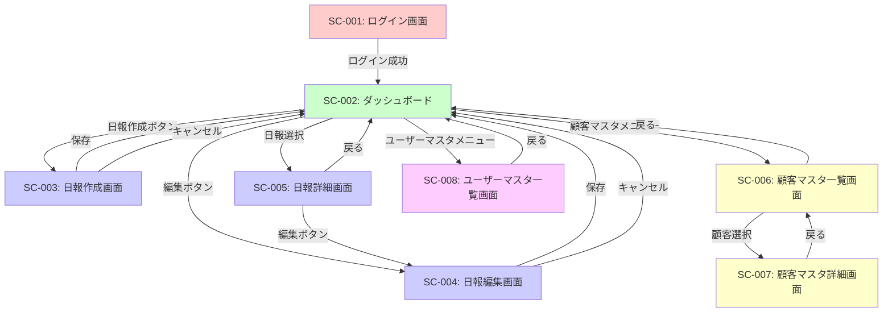

# 営業日報システム 画面定義書

## 1. 画面一覧

| 画面ID | 画面名                 | アクセス権限 | 説明                       |
| ------ | ---------------------- | ------------ | -------------------------- |
| SC-001 | ログイン画面           | 全員         | システムへのログイン       |
| SC-002 | ダッシュボード         | 営業/上長    | 日報一覧の表示             |
| SC-003 | 日報作成画面           | 営業/上長    | 新規日報の作成             |
| SC-004 | 日報編集画面           | 営業/上長    | 既存日報の編集（当日のみ） |
| SC-005 | 日報詳細画面           | 営業/上長    | 日報の詳細表示とコメント   |
| SC-006 | 顧客マスタ一覧画面     | 営業/上長    | 顧客情報の一覧表示         |
| SC-007 | 顧客マスタ詳細画面     | 営業/上長    | 顧客情報の詳細表示         |
| SC-008 | ユーザーマスタ一覧画面 | 管理者       | ユーザー情報の一覧表示     |

## 2. 画面遷移図



---

## 3. 画面詳細仕様

### SC-001: ログイン画面

#### 概要

- ユーザーがシステムにログインするための画面
- メールアドレスとパスワードで認証

#### アクセス権限

- 全員（未認証ユーザー）

#### 表示項目

| 項目名               | 項目タイプ         | 必須 | 説明                         |
| -------------------- | ------------------ | ---- | ---------------------------- |
| システムタイトル     | ラベル             | -    | "営業日報システム"           |
| メールアドレス入力欄 | テキストボックス   | ○    | ログインID（メールアドレス） |
| パスワード入力欄     | パスワードボックス | ○    | パスワード（マスク表示）     |
| ログインボタン       | ボタン             | -    | ログイン処理を実行           |

#### バリデーション

| 項目           | ルール     | エラーメッセージ                                 |
| -------------- | ---------- | ------------------------------------------------ |
| メールアドレス | 必須入力   | "メールアドレスを入力してください"               |
| メールアドレス | メール形式 | "正しいメールアドレス形式で入力してください"     |
| パスワード     | 必須入力   | "パスワードを入力してください"                   |
| 認証           | 認証成功   | "メールアドレスまたはパスワードが間違っています" |

#### 処理フロー

1. メールアドレスとパスワードを入力
2. 「ログイン」ボタンをクリック
3. 入力値のバリデーション
4. データベースで認証
5. 認証成功 → ダッシュボードへ遷移
6. 認証失敗 → エラーメッセージ表示

#### ワイヤーフレーム

```
┌────────────────────────────────────┐
│                                    │
│      営業日報システム              │
│                                    │
│  ┌────────────────────────────┐   │
│  │ メールアドレス                │   │
│  │ [________________]            │   │
│  └────────────────────────────┘   │
│                                    │
│  ┌────────────────────────────┐   │
│  │ パスワード                    │   │
│  │ [________________]            │   │
│  └────────────────────────────┘   │
│                                    │
│       ┌──────────┐                │
│       │ ログイン │                │
│       └──────────┘                │
│                                    │
└────────────────────────────────────┘
```

---

### SC-002: ダッシュボード（日報一覧画面）

#### 概要

- ログイン後の最初の画面
- 営業：自分の日報一覧を表示
- 上長：配下の営業の日報一覧を表示

#### アクセス権限

- 営業/上長

#### 表示項目

| 項目名                 | 項目タイプ | 必須 | 説明                                                     |
| ---------------------- | ---------- | ---- | -------------------------------------------------------- |
| ヘッダー               | -          | -    | システム名、ユーザー名、ログアウトボタン                 |
| ナビゲーションメニュー | メニュー   | -    | ダッシュボード、顧客マスタ、ユーザーマスタ（管理者のみ） |
| 日報作成ボタン         | ボタン     | -    | 日報作成画面へ遷移（営業/上長のみ）                      |
| 検索条件               | -          | -    | 日付範囲、担当者（上長のみ）                             |
| 日報一覧テーブル       | テーブル   | -    | 日報の一覧                                               |

#### 日報一覧テーブルの列

| 列名       | 表示内容       | ソート | 備考                |
| ---------- | -------------- | ------ | ------------------- |
| 日付       | 日報日付       | ○      | YYYY/MM/DD形式      |
| 担当者     | 営業名         | ○      | 上長の場合のみ表示  |
| 訪問件数   | 訪問記録の件数 | ○      | 例：3件             |
| コメント数 | コメントの件数 | ○      | 例：2件             |
| 状態       | 編集可否       | -      | "編集可" or "確定"  |
| アクション | ボタン         | -      | "詳細"/"編集"ボタン |

#### 検索条件

| 項目         | タイプ         | 説明                         |
| ------------ | -------------- | ---------------------------- |
| 日付（開始） | 日付入力       | 検索開始日                   |
| 日付（終了） | 日付入力       | 検索終了日                   |
| 担当者       | ドロップダウン | 配下の営業を選択（上長のみ） |
| 検索ボタン   | ボタン         | 検索実行                     |
| クリアボタン | ボタン         | 検索条件をクリア             |

#### 処理フロー

1. ログイン後、自動的にダッシュボードを表示
2. 営業：自分の日報一覧を表示（デフォルト：直近30日）
3. 上長：配下の営業の日報一覧を表示（デフォルト：直近30日、全担当者）
4. 検索条件を変更して絞り込み可能
5. 「詳細」ボタン → 日報詳細画面へ遷移
6. 「編集」ボタン → 日報編集画面へ遷移（当日の日報のみ表示）

#### ワイヤーフレーム

```
┌────────────────────────────────────────────────────────────┐
│ 営業日報システム                    田中太郎 [ログアウト] │
├────────────────────────────────────────────────────────────┤
│ [ダッシュボード] [顧客マスタ] [ユーザーマスタ]            │
├────────────────────────────────────────────────────────────┤
│                                                            │
│  ┌──────────────────────────────────────────────────┐     │
│  │ 検索条件                                          │     │
│  │ 日付: [2024/01/01] ～ [2024/01/31]              │     │
│  │ 担当者: [全て ▼]  [検索] [クリア]               │     │
│  └──────────────────────────────────────────────────┘     │
│                                                            │
│  [+ 日報作成]                                             │
│                                                            │
│  ┌──────────────────────────────────────────────────┐     │
│  │ 日報一覧                                          │     │
│  ├────┬────┬────┬────┬────┬────────┤     │
│  │日付  │担当者│訪問件数│コメント│状態│アクション│     │
│  ├────┼────┼────┼────┼────┼────────┤     │
│  │01/31 │田中  │3件   │2件  │編集可│[詳細][編集]│     │
│  │01/30 │田中  │2件   │1件  │確定 │[詳細]      │     │
│  │01/29 │田中  │4件   │0件  │確定 │[詳細]      │     │
│  └────┴────┴────┴────┴────┴────────┘     │
│                                                            │
│  << < 1 2 3 4 5 > >>                                      │
│                                                            │
└────────────────────────────────────────────────────────────┘
```

---

### SC-003: 日報作成画面

#### 概要

- 新規日報を作成する画面
- 訪問記録を複数件追加可能
- Problem、Planを入力

#### アクセス権限

- 営業/上長

#### 表示項目

| 項目名             | 項目タイプ     | 必須 | 説明                        |
| ------------------ | -------------- | ---- | --------------------------- |
| 日報日付           | 日付入力       | ○    | デフォルト：今日            |
| 訪問記録セクション | -              | -    | 訪問記録の追加・削除        |
| 訪問記録追加ボタン | ボタン         | -    | 訪問記録を追加              |
| Problem入力欄      | テキストエリア | -    | 課題・相談（500文字以内）   |
| Plan入力欄         | テキストエリア | -    | 明日やること（500文字以内） |
| 保存ボタン         | ボタン         | -    | 日報を保存                  |
| キャンセルボタン   | ボタン         | -    | ダッシュボードへ戻る        |

#### 訪問記録の入力項目

| 項目       | タイプ         | 必須 | 説明                     |
| ---------- | -------------- | ---- | ------------------------ |
| 訪問順序   | 表示のみ       | -    | 自動採番（1, 2, 3...）   |
| 顧客       | ドロップダウン | ○    | 顧客マスタから選択       |
| 訪問内容   | テキストエリア | ○    | 訪問内容（1000文字以内） |
| 削除ボタン | ボタン         | -    | この訪問記録を削除       |

#### バリデーション

| 項目     | ルール       | エラーメッセージ                              |
| -------- | ------------ | --------------------------------------------- |
| 日報日付 | 必須入力     | "日報日付を入力してください"                  |
| 日報日付 | 未来日不可   | "未来の日付は選択できません"                  |
| 日報日付 | 重複チェック | "この日付の日報は既に作成されています"        |
| 訪問記録 | 1件以上      | "訪問記録を少なくとも1件追加してください"     |
| 顧客     | 必須選択     | "顧客を選択してください"                      |
| 訪問内容 | 必須入力     | "訪問内容を入力してください"                  |
| 訪問内容 | 文字数制限   | "訪問内容は1000文字以内で入力してください"    |
| Problem  | 文字数制限   | "課題・相談は500文字以内で入力してください"   |
| Plan     | 文字数制限   | "明日やることは500文字以内で入力してください" |

#### 処理フロー

1. ダッシュボードから「日報作成」ボタンをクリック
2. 日報作成画面を表示（日付はデフォルトで今日）
3. 訪問記録を追加
   - 「訪問記録追加」ボタンをクリック
   - 顧客を選択
   - 訪問内容を入力
   - 必要に応じて複数追加
4. Problem、Planを入力
5. 「保存」ボタンをクリック
6. バリデーション実行
7. 保存成功 → ダッシュボードへ遷移（成功メッセージ表示）
8. 保存失敗 → エラーメッセージ表示

#### ワイヤーフレーム

```
┌────────────────────────────────────────────────────────────┐
│ 営業日報システム > 日報作成                                │
├────────────────────────────────────────────────────────────┤
│                                                            │
│  日報日付: [2024/01/31 ▼]                                 │
│                                                            │
│  ━━━━━━━━━━━━━━━━━━━━━━━━━━━━━━━━━━━━━━━━                │
│  訪問記録                                                  │
│  ━━━━━━━━━━━━━━━━━━━━━━━━━━━━━━━━━━━━━━━━                │
│                                                            │
│  ┌────────────────────────────────────────────────┐       │
│  │ 訪問順序: 1                              [削除] │       │
│  │ 顧客: [株式会社ABC ▼]                          │       │
│  │ 訪問内容:                                       │       │
│  │ ┌────────────────────────────────────────┐     │       │
│  │ │新商品の提案を実施。               │     │       │
│  │ │次回アポイント: 2/15               │     │       │
│  │ └────────────────────────────────────────┘     │       │
│  └────────────────────────────────────────────────┘       │
│                                                            │
│  ┌────────────────────────────────────────────────┐       │
│  │ 訪問順序: 2                              [削除] │       │
│  │ 顧客: [株式会社XYZ ▼]                          │       │
│  │ 訪問内容:                                       │       │
│  │ ┌────────────────────────────────────────┐     │       │
│  │ │契約更新の打ち合わせ           │     │       │
│  │ │                                        │     │       │
│  │ └────────────────────────────────────────┘     │       │
│  └────────────────────────────────────────────────┘       │
│                                                            │
│  [+ 訪問記録を追加]                                       │
│                                                            │
│  ━━━━━━━━━━━━━━━━━━━━━━━━━━━━━━━━━━━━━━━━                │
│  Problem（課題・相談）                                     │
│  ━━━━━━━━━━━━━━━━━━━━━━━━━━━━━━━━━━━━━━━━                │
│  ┌────────────────────────────────────────────────┐       │
│  │株式会社ABCの決裁者へのアポが取れない。        │       │
│  │上長からのアドバイスをいただきたい。            │       │
│  │                                                 │       │
│  └────────────────────────────────────────────────┘       │
│                                                            │
│  ━━━━━━━━━━━━━━━━━━━━━━━━━━━━━━━━━━━━━━━━                │
│  Plan（明日やること）                                      │
│  ━━━━━━━━━━━━━━━━━━━━━━━━━━━━━━━━━━━━━━━━                │
│  ┌────────────────────────────────────────────────┐       │
│  │- 株式会社DEFへの提案書作成                     │       │
│  │- 株式会社GHIへのフォローコール                 │       │
│  │                                                 │       │
│  └────────────────────────────────────────────────┘       │
│                                                            │
│  [保存]  [キャンセル]                                     │
│                                                            │
└────────────────────────────────────────────────────────────┘
```

---

### SC-004: 日報編集画面

#### 概要

- 既存の日報を編集する画面
- 当日の日報のみ編集可能
- 画面レイアウトは日報作成画面とほぼ同じ

#### アクセス権限

- 営業/上長（自分の日報のみ）

#### 表示項目

- SC-003（日報作成画面）と同じ
- ただし、既存のデータが初期表示される

#### バリデーション

- SC-003（日報作成画面）と同じ
- 追加：編集可能日チェック → "当日の日報のみ編集できます"

#### 処理フロー

1. ダッシュボードまたは日報詳細画面から「編集」ボタンをクリック
2. 日報編集画面を表示
3. 既存のデータを表示
4. 各項目を編集
5. 「保存」ボタンをクリック
6. バリデーション実行
7. 保存成功 → 日報詳細画面へ遷移（成功メッセージ表示）
8. 保存失敗 → エラーメッセージ表示

#### 注意事項

- 日報日付の変更は不可（表示のみ）
- 訪問記録の削除は可能
- 当日以外の日報の編集を試みた場合、エラーメッセージを表示してダッシュボードへ戻る

---

### SC-005: 日報詳細画面

#### 概要

- 日報の詳細を表示し、上長がコメントを投稿できる画面

#### アクセス権限

- 営業：自分の日報
- 上長：配下の営業の日報

#### 表示項目

| 項目名             | 項目タイプ     | 説明                               |
| ------------------ | -------------- | ---------------------------------- |
| 日報情報           | -              | 日付、担当者、作成日時、更新日時   |
| 訪問記録一覧       | テーブル       | 訪問順序、顧客名、訪問内容         |
| Problem            | テキスト表示   | 課題・相談                         |
| Plan               | テキスト表示   | 明日やること                       |
| コメント一覧       | リスト         | コメント者、投稿日時、コメント内容 |
| コメント入力欄     | テキストエリア | 新規コメント入力（上長のみ）       |
| コメント投稿ボタン | ボタン         | コメントを投稿（上長のみ）         |
| 編集ボタン         | ボタン         | 日報編集画面へ遷移（当日のみ表示） |
| 戻るボタン         | ボタン         | ダッシュボードへ戻る               |

#### 訪問記録一覧テーブルの列

| 列名     | 表示内容             |
| -------- | -------------------- |
| 訪問順序 | 1, 2, 3...           |
| 顧客名   | 会社名 - 顧客名      |
| 訪問内容 | 訪問内容（改行保持） |

#### コメント一覧の表示項目

| 項目             | 表示内容                 |
| ---------------- | ------------------------ |
| コメント者       | 上長の名前               |
| 投稿日時         | YYYY/MM/DD HH:MM         |
| コメント内容     | コメント内容（改行保持） |
| 編集・削除ボタン | コメント投稿者のみ表示   |

#### バリデーション

| 項目         | ルール     | エラーメッセージ                           |
| ------------ | ---------- | ------------------------------------------ |
| コメント内容 | 必須入力   | "コメント内容を入力してください"           |
| コメント内容 | 文字数制限 | "コメントは1000文字以内で入力してください" |

#### 処理フロー

1. ダッシュボードから日報を選択
2. 日報詳細画面を表示
3. 訪問記録、Problem、Plan、既存コメントを表示
4. 上長の場合：
   - コメント入力欄にコメントを入力
   - 「コメント投稿」ボタンをクリック
   - コメントが投稿され、コメント一覧に追加表示
5. 当日の日報の場合：
   - 「編集」ボタンが表示される
   - クリックで日報編集画面へ遷移

#### ワイヤーフレーム

```
┌────────────────────────────────────────────────────────────┐
│ 営業日報システム > 日報詳細                                │
├────────────────────────────────────────────────────────────┤
│                                                            │
│  [< 戻る]                                   [編集]        │
│                                                            │
│  ━━━━━━━━━━━━━━━━━━━━━━━━━━━━━━━━━━━━━━━━                │
│  日報情報                                                  │
│  ━━━━━━━━━━━━━━━━━━━━━━━━━━━━━━━━━━━━━━━━                │
│  日付: 2024/01/31                                          │
│  担当者: 田中太郎                                          │
│  作成日時: 2024/01/31 18:30                               │
│  更新日時: 2024/01/31 19:00                               │
│                                                            │
│  ━━━━━━━━━━━━━━━━━━━━━━━━━━━━━━━━━━━━━━━━                │
│  訪問記録                                                  │
│  ━━━━━━━━━━━━━━━━━━━━━━━━━━━━━━━━━━━━━━━━                │
│  ┌────────────────────────────────────────────────┐       │
│  │ 1. 株式会社ABC - 山田太郎                      │       │
│  │    新商品の提案を実施。                         │       │
│  │    次回アポイント: 2/15                         │       │
│  └────────────────────────────────────────────────┘       │
│  ┌────────────────────────────────────────────────┐       │
│  │ 2. 株式会社XYZ - 鈴木花子                      │       │
│  │    契約更新の打ち合わせ                         │       │
│  └────────────────────────────────────────────────┘       │
│                                                            │
│  ━━━━━━━━━━━━━━━━━━━━━━━━━━━━━━━━━━━━━━━━                │
│  Problem（課題・相談）                                     │
│  ━━━━━━━━━━━━━━━━━━━━━━━━━━━━━━━━━━━━━━━━                │
│  株式会社ABCの決裁者へのアポが取れない。                  │
│  上長からのアドバイスをいただきたい。                      │
│                                                            │
│  ━━━━━━━━━━━━━━━━━━━━━━━━━━━━━━━━━━━━━━━━                │
│  Plan（明日やること）                                      │
│  ━━━━━━━━━━━━━━━━━━━━━━━━━━━━━━━━━━━━━━━━                │
│  - 株式会社DEFへの提案書作成                               │
│  - 株式会社GHIへのフォローコール                           │
│                                                            │
│  ━━━━━━━━━━━━━━━━━━━━━━━━━━━━━━━━━━━━━━━━                │
│  コメント                                                  │
│  ━━━━━━━━━━━━━━━━━━━━━━━━━━━━━━━━━━━━━━━━                │
│  ┌────────────────────────────────────────────────┐       │
│  │ 佐藤部長  2024/01/31 20:30              [編集][削除]│  │
│  │ 株式会社ABCについては、私から決裁者に           │       │
│  │ コンタクトを取ってみます。                      │       │
│  └────────────────────────────────────────────────┘       │
│                                                            │
│  ┌────────────────────────────────────────────────┐       │
│  │ コメントを入力                                  │       │
│  │ ┌────────────────────────────────────────┐     │       │
│  │ │                                            │     │       │
│  │ │                                            │     │       │
│  │ └────────────────────────────────────────┘     │       │
│  │ [コメント投稿]                                  │       │
│  └────────────────────────────────────────────────┘       │
│                                                            │
└────────────────────────────────────────────────────────────┘
```

---

### SC-006: 顧客マスタ一覧画面

#### 概要

- 顧客情報の一覧を表示
- 検索・絞り込み機能

#### アクセス権限

- 営業/上長

#### 表示項目

| 項目名           | 項目タイプ | 説明                     |
| ---------------- | ---------- | ------------------------ |
| 検索条件         | -          | 顧客名、会社名、担当営業 |
| 顧客一覧テーブル | テーブル   | 顧客の一覧               |

#### 顧客一覧テーブルの列

| 列名           | 表示内容       | ソート | 備考         |
| -------------- | -------------- | ------ | ------------ |
| 顧客ID         | 顧客ID         | ○      | -            |
| 会社名         | 会社名         | ○      | -            |
| 顧客名         | 顧客名         | ○      | -            |
| 電話番号       | 電話番号       | -      | -            |
| メールアドレス | メールアドレス | -      | -            |
| 担当営業       | 営業名         | ○      | -            |
| アクション     | ボタン         | -      | "詳細"ボタン |

#### 検索条件

| 項目         | タイプ         | 説明             |
| ------------ | -------------- | ---------------- |
| 会社名       | テキスト入力   | 部分一致検索     |
| 顧客名       | テキスト入力   | 部分一致検索     |
| 担当営業     | ドロップダウン | 完全一致検索     |
| 検索ボタン   | ボタン         | 検索実行         |
| クリアボタン | ボタン         | 検索条件をクリア |

#### 処理フロー

1. ナビゲーションメニューから「顧客マスタ」を選択
2. 顧客マスタ一覧画面を表示
3. 検索条件を指定して絞り込み可能
4. 「詳細」ボタン → 顧客マスタ詳細画面へ遷移

#### ワイヤーフレーム

```
┌────────────────────────────────────────────────────────────┐
│ 営業日報システム > 顧客マスタ                              │
├────────────────────────────────────────────────────────────┤
│                                                            │
│  ┌──────────────────────────────────────────────────┐     │
│  │ 検索条件                                          │     │
│  │ 会社名: [________]  顧客名: [________]           │     │
│  │ 担当営業: [全て ▼]  [検索] [クリア]             │     │
│  └──────────────────────────────────────────────────┘     │
│                                                            │
│  ┌──────────────────────────────────────────────────┐     │
│  │ 顧客一覧                                          │     │
│  ├────┬────┬────┬────┬────┬────┬────┤     │
│  │ID  │会社名│顧客名│電話番号│メール│担当 │アクション│  │
│  ├────┼────┼────┼────┼────┼────┼────┤     │
│  │001 │ABC  │山田  │03-1234-│xxx@  │田中 │[詳細]    │  │
│  │002 │XYZ  │鈴木  │06-5678-│yyy@  │佐藤 │[詳細]    │  │
│  │003 │DEF  │高橋  │03-9012-│zzz@  │田中 │[詳細]    │  │
│  └────┴────┴────┴────┴────┴────┴────┘     │
│                                                            │
│  << < 1 2 3 4 5 > >>                                      │
│                                                            │
└────────────────────────────────────────────────────────────┘
```

---

### SC-007: 顧客マスタ詳細画面

#### 概要

- 顧客の詳細情報を表示

#### アクセス権限

- 営業/上長

#### 表示項目

| 項目名         | 表示内容                 |
| -------------- | ------------------------ |
| 顧客ID         | 顧客ID                   |
| 会社名         | 会社名                   |
| 顧客名         | 顧客名                   |
| 住所           | 住所                     |
| 電話番号       | 電話番号                 |
| メールアドレス | メールアドレス           |
| 担当営業       | 営業名                   |
| 備考           | 備考                     |
| 作成日時       | 作成日時                 |
| 更新日時       | 更新日時                 |
| 戻るボタン     | 顧客マスタ一覧画面へ戻る |

#### 処理フロー

1. 顧客マスタ一覧画面から「詳細」ボタンをクリック
2. 顧客マスタ詳細画面を表示
3. 顧客情報を確認
4. 「戻る」ボタン → 顧客マスタ一覧画面へ戻る

#### ワイヤーフレーム

```
┌────────────────────────────────────────────────────────────┐
│ 営業日報システム > 顧客マスタ > 詳細                       │
├────────────────────────────────────────────────────────────┤
│                                                            │
│  [< 戻る]                                                  │
│                                                            │
│  ━━━━━━━━━━━━━━━━━━━━━━━━━━━━━━━━━━━━━━━━                │
│  顧客情報                                                  │
│  ━━━━━━━━━━━━━━━━━━━━━━━━━━━━━━━━━━━━━━━━                │
│                                                            │
│  顧客ID: 001                                               │
│  会社名: 株式会社ABC                                       │
│  顧客名: 山田太郎                                          │
│  住所: 東京都渋谷区〇〇1-2-3                               │
│  電話番号: 03-1234-5678                                    │
│  メールアドレス: yamada@abc.co.jp                          │
│  担当営業: 田中太郎                                        │
│  備考: VIP顧客。毎月訪問必須。                             │
│                                                            │
│  作成日時: 2024/01/01 10:00                               │
│  更新日時: 2024/01/15 14:30                               │
│                                                            │
└────────────────────────────────────────────────────────────┘
```

---

### SC-008: ユーザーマスタ一覧画面

#### 概要

- ユーザー（営業・上長）の一覧を表示
- 管理者のみアクセス可能

#### アクセス権限

- 管理者

#### 表示項目

| 項目名               | 項目タイプ | 説明                             |
| -------------------- | ---------- | -------------------------------- |
| 検索条件             | -          | 名前、メールアドレス、役割、部署 |
| ユーザー一覧テーブル | テーブル   | ユーザーの一覧                   |

#### ユーザー一覧テーブルの列

| 列名           | 表示内容       | ソート | 備考                     |
| -------------- | -------------- | ------ | ------------------------ |
| ユーザーID     | ユーザーID     | ○      | -                        |
| 氏名           | 氏名           | ○      | -                        |
| メールアドレス | メールアドレス | ○      | -                        |
| 役割           | 営業/上長      | ○      | -                        |
| 上長           | 上長の氏名     | -      | 役割が営業の場合のみ表示 |
| 部署           | 部署名         | ○      | -                        |
| 状態           | 有効/無効      | -      | is_deleted フラグ        |

#### 検索条件

| 項目           | タイプ         | 説明             |
| -------------- | -------------- | ---------------- |
| 氏名           | テキスト入力   | 部分一致検索     |
| メールアドレス | テキスト入力   | 部分一致検索     |
| 役割           | ドロップダウン | 営業/上長/全て   |
| 部署           | テキスト入力   | 部分一致検索     |
| 状態           | ドロップダウン | 有効/無効/全て   |
| 検索ボタン     | ボタン         | 検索実行         |
| クリアボタン   | ボタン         | 検索条件をクリア |

#### 処理フロー

1. ナビゲーションメニューから「ユーザーマスタ」を選択（管理者のみ表示）
2. ユーザーマスタ一覧画面を表示
3. 検索条件を指定して絞り込み可能

#### ワイヤーフレーム

```
┌────────────────────────────────────────────────────────────┐
│ 営業日報システム > ユーザーマスタ                          │
├────────────────────────────────────────────────────────────┤
│                                                            │
│  ┌──────────────────────────────────────────────────┐     │
│  │ 検索条件                                          │     │
│  │ 氏名: [________]  メール: [________]             │     │
│  │ 役割: [全て ▼]  部署: [________]                │     │
│  │ 状態: [全て ▼]  [検索] [クリア]                 │     │
│  └──────────────────────────────────────────────────┘     │
│                                                            │
│  ┌──────────────────────────────────────────────────┐     │
│  │ ユーザー一覧                                      │     │
│  ├────┬────┬────┬────┬────┬────┬────┤     │
│  │ID  │氏名  │メール│役割 │上長 │部署 │状態    │     │
│  ├────┼────┼────┼────┼────┼────┼────┤     │
│  │001 │田中  │tanaka│営業 │佐藤 │営業1│有効    │     │
│  │002 │佐藤  │sato@ │上長 │-    │営業1│有効    │     │
│  │003 │鈴木  │suzuki│営業 │佐藤 │営業1│有効    │     │
│  └────┴────┴────┴────┴────┴────┴────┘     │
│                                                            │
│  << < 1 2 3 4 5 > >>                                      │
│                                                            │
└────────────────────────────────────────────────────────────┘
```

---

## 4. 共通仕様

### 4.1 ヘッダー

全画面（ログイン画面を除く）に共通で表示

| 項目             | 説明                                       |
| ---------------- | ------------------------------------------ |
| システム名       | "営業日報システム"                         |
| ユーザー名       | ログインユーザーの氏名                     |
| ログアウトボタン | クリックでログアウトしてログイン画面へ遷移 |

### 4.2 ナビゲーションメニュー

全画面（ログイン画面を除く）に共通で表示

| メニュー項目   | 遷移先 | 表示条件   |
| -------------- | ------ | ---------- |
| ダッシュボード | SC-002 | 全員       |
| 顧客マスタ     | SC-006 | 全員       |
| ユーザーマスタ | SC-008 | 管理者のみ |

### 4.3 ページング

一覧画面で表示件数が多い場合、ページングを表示

| 設定項目                | 値                  |
| ----------------------- | ------------------- |
| 1ページあたりの表示件数 | 20件                |
| ページャーの表示        | << < 1 2 3 4 5 > >> |

### 4.4 メッセージ表示

#### 成功メッセージ

- 画面上部に緑色の背景で表示
- 3秒後に自動的に消える
- 例：「日報を保存しました」

#### エラーメッセージ

- 画面上部に赤色の背景で表示
- ユーザーが×ボタンで閉じるまで表示
- 例：「日報の保存に失敗しました」

#### 確認ダイアログ

- 削除や破棄の操作時に表示
- 「OK」「キャンセル」ボタン
- 例：「この訪問記録を削除してもよろしいですか?」

### 4.5 レスポンシブ対応

#### PC（1024px以上）

- 横並びレイアウト
- サイドバーナビゲーション
- テーブル形式での一覧表示

#### タブレット（768px〜1023px）

- 一部縦並びレイアウト
- ハンバーガーメニュー
- テーブル形式での一覧表示（横スクロール対応）

#### スマートフォン（767px以下）

- 縦並びレイアウト
- ハンバーガーメニュー
- カード形式での一覧表示

---

## 5. 非機能要件

### 5.1 ブラウザ対応

- Google Chrome（最新版）
- Microsoft Edge（最新版）
- Safari（最新版）
- Firefox（最新版）

### 5.2 セキュリティ

- HTTPS通信
- CSRF対策
- XSS対策
- SQLインジェクション対策

### 5.3 アクセシビリティ

- キーボード操作対応
- スクリーンリーダー対応
- 適切なコントラスト比

---

## 6. 備考

### 6.1 今後の追加画面候補

- 顧客マスタ登録・編集画面
- ユーザーマスタ登録・編集画面
- パスワード変更画面
- プロフィール編集画面
- 月次レポート画面
- 統計・分析画面

### 6.2 改善検討事項

- 訪問予定の登録機能
- 通知機能（コメント通知など）
- ファイル添付機能
- エクスポート機能（Excel、PDF）
- 一括操作機能
